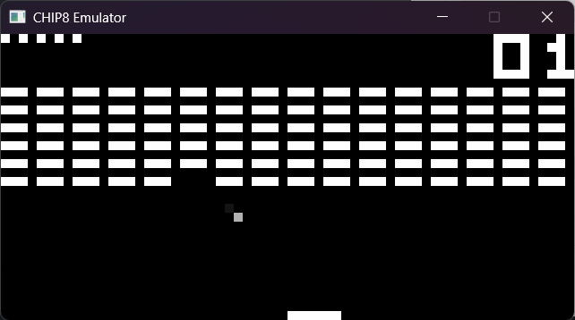
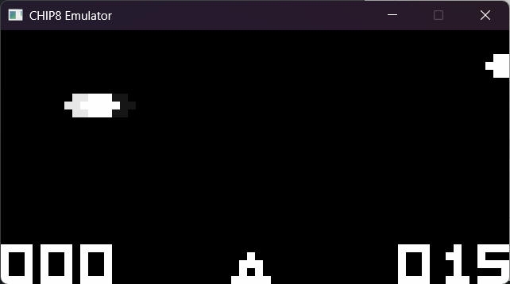

# CHIP‑8 Emulator

A CHIP‑8 emulator written in Go, using SDL3 for graphics, input, and audio. I built it to learn emulation development. Any feedback is greatly appreciated.

> **Status:** Early but playable. Core opcodes implemented; audio, timers, and input are wired up. Currently only CHIP-8 is fully supported.

## Screenshots




## Quick Start

### Prerequisites

* **Go** (tested with 1.23.1)
* **SDL3** runtime 
* Go module: `github.com/jupiterrider/purego-sdl3/sdl`

### Build & Run

```bash
# Clone
git clone https://github.com/KonyD/chip8-emulator.git && cd chip8-emulator

# Run a ROM
go run . name="games/UFO [Lutz V, 1992].ch8"

# Or build
go build -o chip8
./chip8 name="games/UFO [Lutz V, 1992].ch8"
```

> Place `.ch8` ROMs under `./roms/`.

## Controls

```
 CHIP‑8 Keypad        Mapped Keys
 ┌───┬───┬───┬───┐    ┌───┬───┬───┬───┐
 │ 1 │ 2 │ 3 │ C │    │ 1 │ 2 │ 3 │ 4 │
 ├───┼───┼───┼───┤    ├───┼───┼───┼───┤
 │ 4 │ 5 │ 6 │ D │    │ Q │ W │ E │ R │
 ├───┼───┼───┼───┤    ├───┼───┼───┼───┤
 │ 7 │ 8 │ 9 │ E │    │ A │ S │ D │ F │
 ├───┼───┼───┼───┤    ├───┼───┼───┼───┤
 │ A │ 0 │ B │ F │    │ Z │ X │ C │ V │
 └───┴───┴───┴───┘    └───┴───┴───┴───┘
```

Additional:

* **Esc** - Quit
* **Space** - Pause/Resume
* **R** - Reload current ROM
* **O** - Decrease volume
* **P** - Increase volume
* **J** - Decrease color lerp rate
* **K** - Increase color lerp rate

## Configuration

| Parameter        | Type     | Default Value       | Description                                                                                                                 |
| ---------------- | -------- | ------------------- | --------------------------------------------------------------------------------------------------------------------------- |
| `name`           | `string` | `roms/tests/1-chip8-logo.ch8` | The ROM file to load. Example: `name="games/Tank.ch8"` will load `roms/games/Tank.ch8`.                                           |
| `scale`          | `uint32`    | `10`                | Scales the window size. Each CHIP-8 pixel is drawn as a `scale × scale` square.                                             |
| `pixelOutlines`  | `bool`   | `false`             | If `true`, draws outlines around pixels for a grid-like effect.                                                             |
| `instsPerSecond` | `uint32`    | `500`               | The emulated CPU speed in instructions per second (like the clock rate / Hz). Higher values = faster emulation.             |
| `colorLerpRate`  | `float32`  | `0.7`               | Controls how fast colors transition (lerp rate). Smaller values = slower transitions, larger values = snappier transitions. |

## Roms used 

* test roms: https://github.com/Timendus/chip8-test-suite
* games: https://github.com/kripod/chip8-roms
